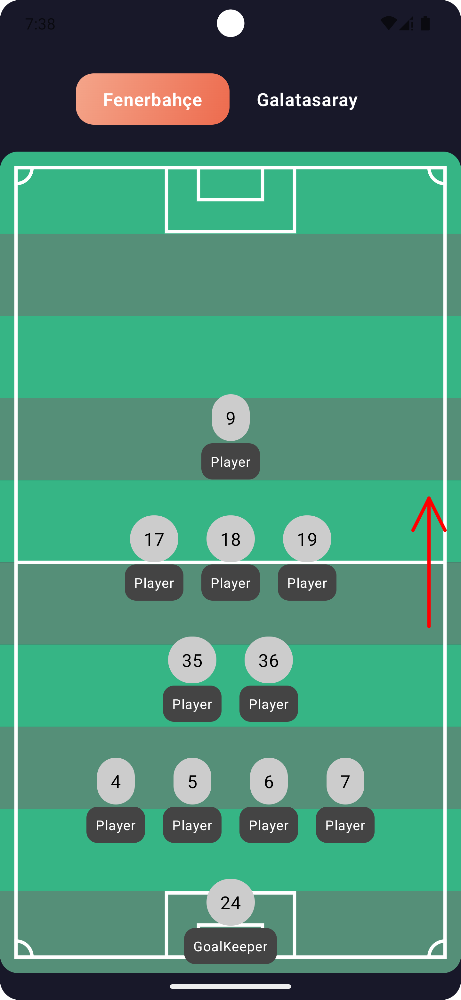
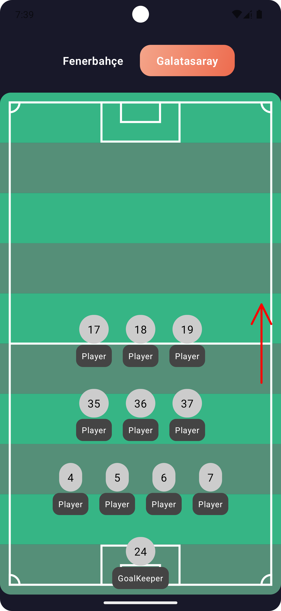

# Football team starting lineup
Football team starting lineup. Built with Compose and canvas 

### Drawing ground
```kt
...

val canvasHeight = size.height
val rectHeight = size.height / 10

...

for (i in 0 until 10) {
    val color = if (i % 2 == 0) Green else DarkGreen

    drawRect(
        color = color,
        topLeft = Offset(0f, i * rectHeight),
        size = Size(width = canvasWidth, height = rectHeight)
    )
}
```
and other [codes...](https://github.com/iamsuatzengin/football-starting-lineup-compose/tree/main/app/src/main/java/com/example/footballstartinglineup/football)
### Screenshots
| Team-1 (4-2-3-1)  | Team-2 (4-3-3) |  
|:----------------------:| :----------------------: | 
|  </img> | </img> |
